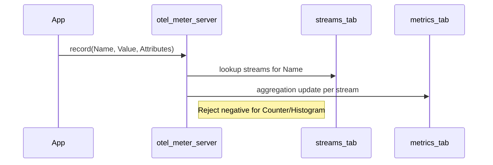
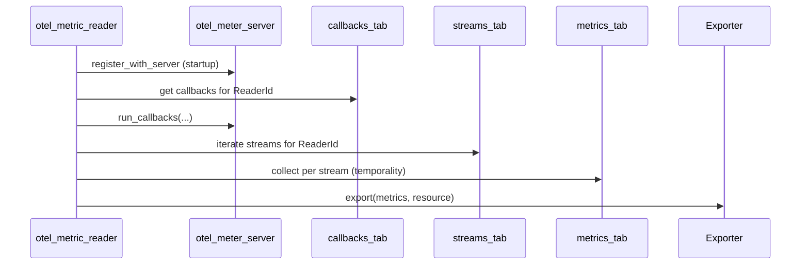

opentelemetry_experimental – Architecture (Metrics SDK)
======================================================

Purpose: Explain how the experimental Metrics SDK is structured so non-Erlang reviewers can validate behavior against the OpenTelemetry spec.

Key components
--------------
- MeterProvider: `otel_meter_server`
  - Creates meters, registers views, accepts instruments and callbacks, and orchestrates per-reader streams and aggregations.
- View engine: `otel_view`
  - Compiles selection criteria (instrument name/kind/unit, meter scope) to ETS match specifications; matches instruments to views; supplies attribute filtering and aggregation overrides.
- Readers: `otel_metric_reader`
  - Runs collection (periodic or pull), applies temporality, exports via configured exporter.
- Aggregations: `otel_aggregation_sum`, `otel_aggregation_last_value`, `otel_aggregation_histogram_explicit`, `otel_aggregation_drop`
  - Maintain and collect metric state per stream; enforce spec semantics.
- Exporters: `otel_metric_exporter_console`, `otel_exporter_metrics_otlp`
  - Serialize and send metrics to stdout or OTLP backends.
- Observables: `otel_observables`
  - Executes callbacks on collection; supports multi-instrument callbacks.
- Exemplars: `otel_metric_exemplar_*`
  - Select and store exemplars according to filter/reservoir configuration.

Data model and storage
----------------------
ETS tables (per MeterProvider instance):
- `instruments_tab`: Registry of created instruments (per meter, per name).
- `callbacks_tab`: Registered observable callbacks keyed by reader id.
- `streams_tab`: View matches per reader; each stream holds aggregation config, temporality, attribute filter, exemplar reservoir.
- `metrics_tab`: Aggregation state bucketed by stream name and attribute set.
- `exemplars_tab`: Exemplar storage per stream.

Supervision and processes
-------------------------
- `otel_meter_server` is a `gen_server` registered as the global MeterProvider.
- Each `otel_metric_reader` is a `gen_server` with an optional periodic timer.
- Exporters are invoked synchronously from readers during `collect`.

Recording flow (synchronous instruments)
---------------------------------------
1) Instrument creation inserts into `instruments_tab` and computes streams by matching views per reader.
2) Application code records a measurement; MeterProvider finds streams for the instrument and updates aggregations.
3) Negative values for monotonic instruments are discarded.

Collection flow (observables and export)
----------------------------------------
1) Reader wakes (timer) or is triggered (pull) and runs `collect`.
2) Reader fetches callbacks for its id and executes them, populating metrics for observable instruments.
3) Reader iterates streams for its id, collects aggregated data (respecting temporality), and calls exporter with resource and scope.

Views and streams
-----------------
- Adding a view triggers recomputation of streams for all existing instruments.
- Streams are per reader; a single instrument may yield multiple streams (one per reader, plus per matching view), each with its own aggregation and temporality.
- Default behavior when no view matches: create a stream using the instrument defaults.

Temporality and forgetting
--------------------------
- Readers hold a mapping from instrument kind to temporality (delta or cumulative).
- Streams with delta temporality reset aggregation state after collection ("forget").
- Observable instruments use "forget" semantics on each collection.

Configuration surface
---------------------
- Readers: `{module, config}` with keys:
  - `export_interval_ms`: integer (periodic) or undefined (pull).
  - `exporter`: `{Module, #{...}}` passed to exporter `init/1`.
  - Optional: default aggregation and temporality mappings.
- Views: list of maps with `selector`, optional `name`, `description`, `attribute_keys`, `aggregation_module`, `aggregation_options` (e.g., histogram bucket boundaries).

Responsibility boundaries
-------------------------
- API (`opentelemetry_api_experimental`) provides instrumentation macros and delegates to the SDK.
- SDK (`opentelemetry_experimental`) enforces aggregation rules, views, temporality, and export.

See also
--------
- `SPEC_COMPLIANCE.md` for spec crosswalk and code anchors.
- Package README for configuration examples.

